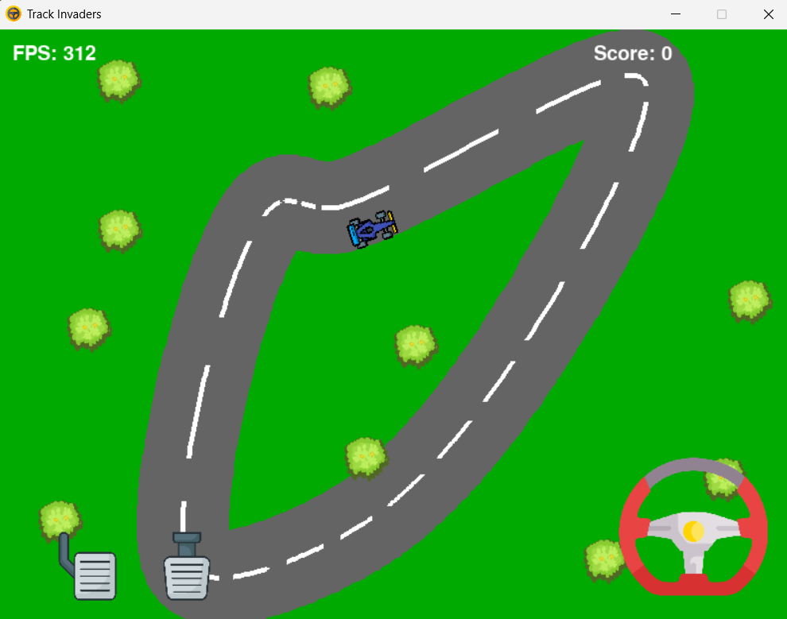
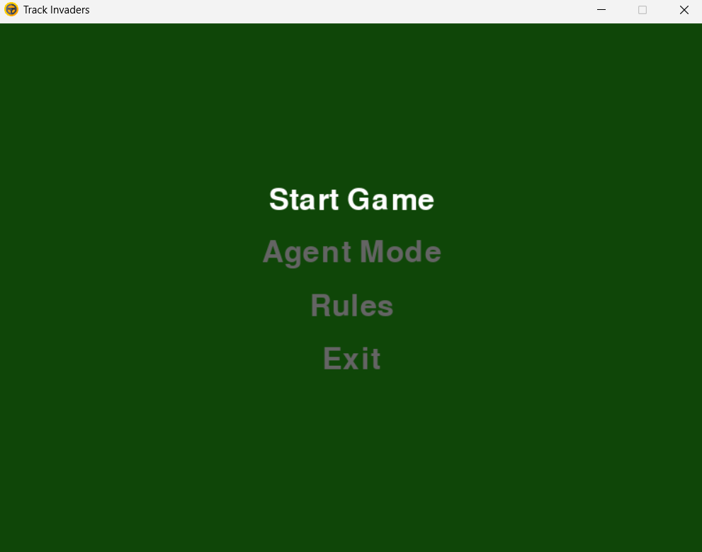
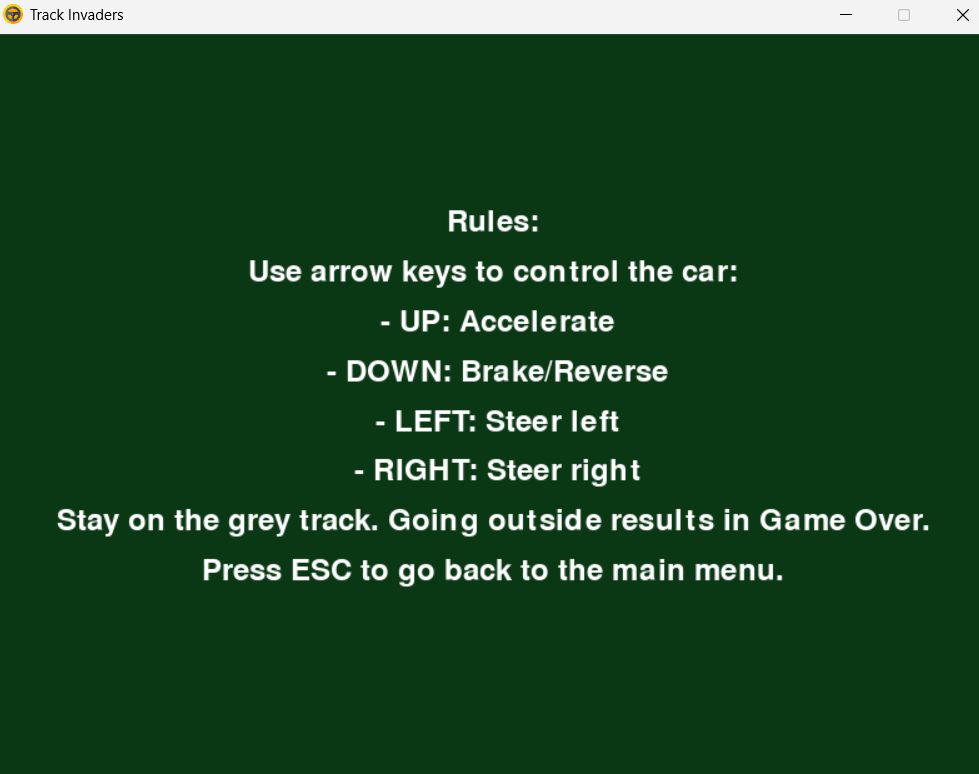

Reinforcement Learning Car Game

This repository contains a reinforcement learning-based car game developed in Python. The game leverages reinforcement
learning algorithms to enable a car to autonomously navigate through a track, learning optimal driving strategies over time.
We have implemented 3 different techniques for this:
1.DeepQ Learning
2.NeuroEvolution of Augmenting Topologies(NEAT)
3.XGBoost(with keras)

Features

Autonomous Driving: The car learns to drive itself using 3 different technqiues.

Customizable Tracks: Users can design and modify tracks to test the car's learning adaptability.

Performance Metrics: Track the car's learning progress and performance over time.

Folders:

4 separate folders are created.

1.Main_Game:
  This contains only basic game which is used as an environment for the agent. User can play this game in order to judge the environment (this can be done in other agent folders well).

2.DQN_Agent1;

3.NEAT_Agent2:
  This contains implementations of NEAT algorithm. Under agent mode in main menu , results of the neat algorithm can be seen.

4.XGBoost_Agent3:
  This contains XGBoost implementation. Apart from the agent results, it also contains training mode in which user can play and generate the training data for training the model furthur.

Installation:: 

Clone the Repository:

git clone https://github.com/Artist06/ReinforcementLearning_Car_Game.git
cd ReinforcementLearning_Car_Game

create a python enivronment (preferred)

1.Using anaconda 

  conda create -p venv python==3.12
  conda activate path(shown after creation of env)

2.python -m venv env_name
  env_name\scripts\activate

Folder name should be any of the four folders described above.
cd folder_name

Install Dependencies:

pip install -r requirements.txt

Run the game:

python main.py

PLAY THE GAME!!!!
ENJOY THE AGENT PLAY GAME!!

Controls

The agent runs autonomously, adjusting direction based on sensor input.
In the Play Game option, user can play using arrow keys.

Game Graphics::

