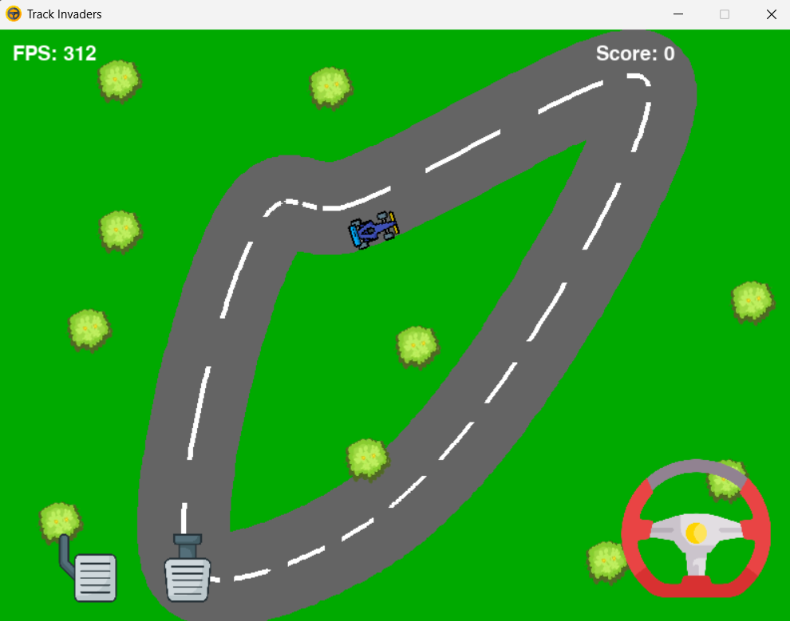
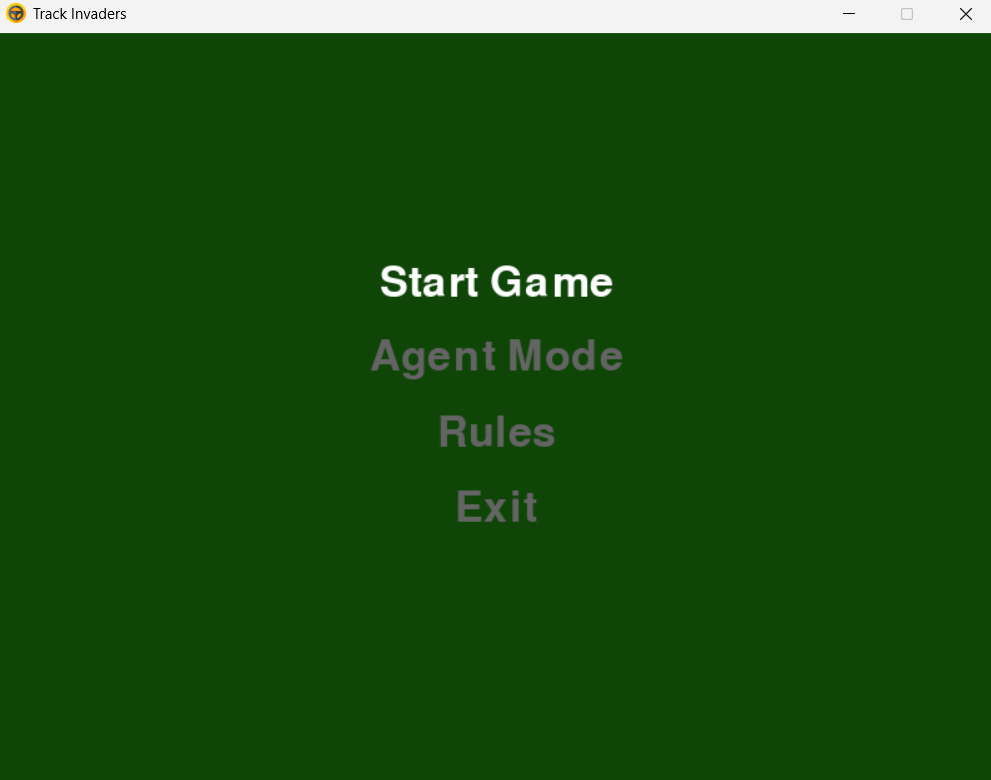
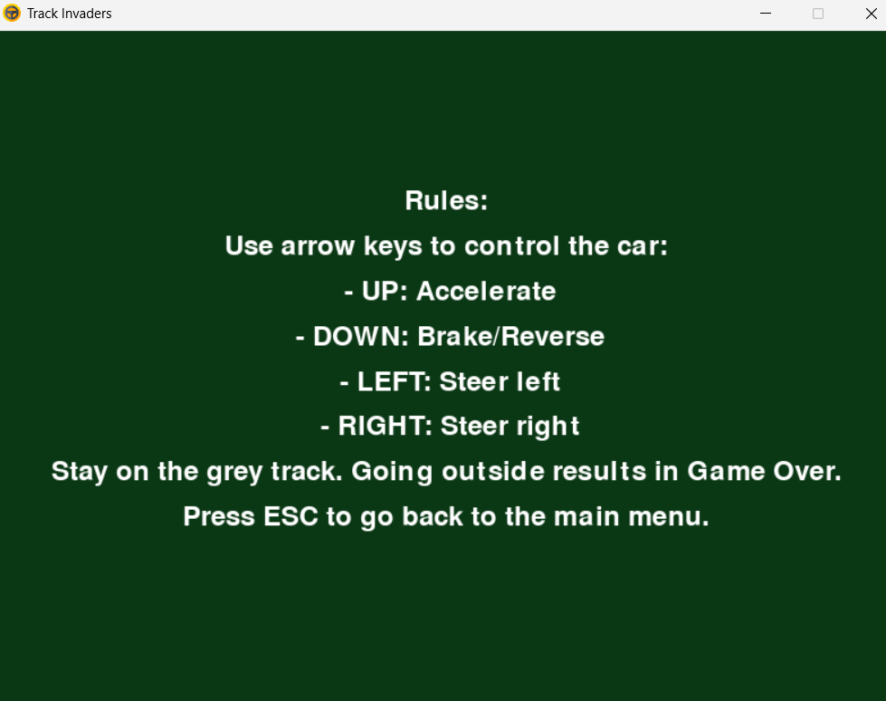
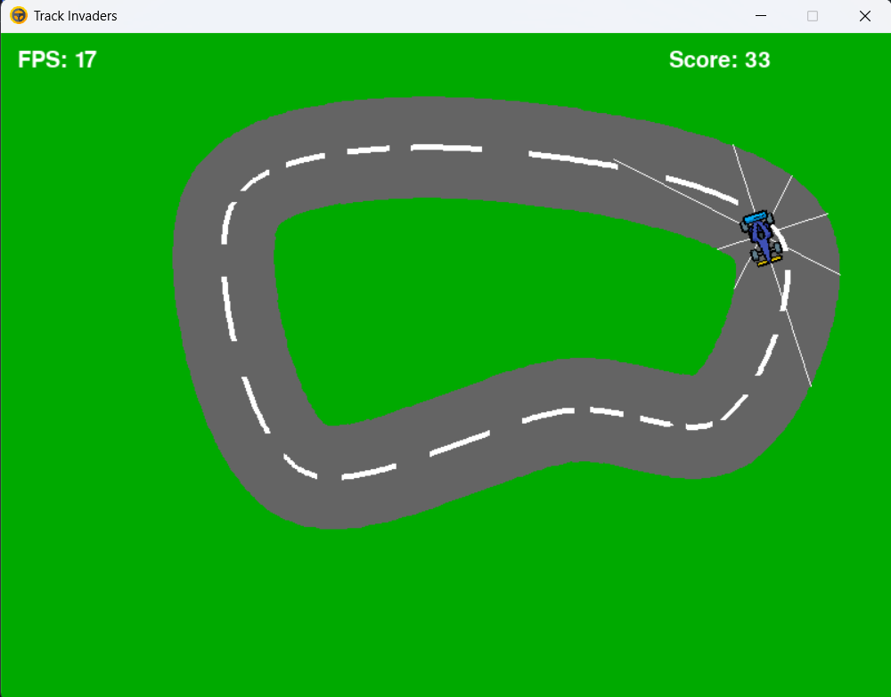

# Reinforcement Learning Car Game

A Python-based car game that implements various reinforcement learning algorithms to enable autonomous driving. The project demonstrates two different machine learning techniques:

1. Deep Q-Learning (DQN)
2. NeuroEvolution of Augmenting Topologies (NEAT)

<<<<<<< HEAD

=======
C:\Users\0adit\Desktop\Acads\Coding\ReinforcementLearning_Car_Game\project_images\player_frame.png
>>>>>>> 5ec77ba38cbd0adb51232283f2c4baef6c4de635

## Features

- **Autonomous Driving**: Self-learning car using two different AI techniques
- **Customizable Tracks**: Design and modify tracks to test learning adaptability
- **Performance Metrics**: Monitor learning progress and performance

## Project Structure

The project is organized into two main folders:

### 1. DQN

- Implementation of Dueling Deep Q-Network
- Features actor-critic model architecture
- Includes extensive replay buffer system

### 2. NEAT

- NEAT algorithm implementation
- View results through agent mode in main menu

## Installation

1. Clone the repository:

```bash
git clone https://github.com/Artist06/ReinforcementLearning_Car_Game.git
cd ReinforcementLearning_Car_Game
```

2. Create a Python environment (recommended):

Option A: Using Anaconda

```bash
conda create -p venv python==3.12
conda activate ./venv
```

Option B: Using venv

```bash
python -m venv env_name
env_name\Scripts\activate
```

3. Navigate to desired implementation:

```bash
cd <folder_name>  # DQN or NEAT
```

4. Install dependencies:

```bash
pip install -r requirements.txt
```

5. Run the game:

```bash
python main.py
```

## Controls

- **Agent Mode**: AI operates autonomously using sensor inputs
- **Player Mode**: Use arrow keys for manual control

## Screenshots

### Main Menu



### Rules Page



### Agent in Action


